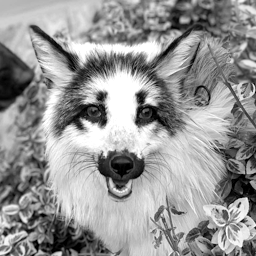
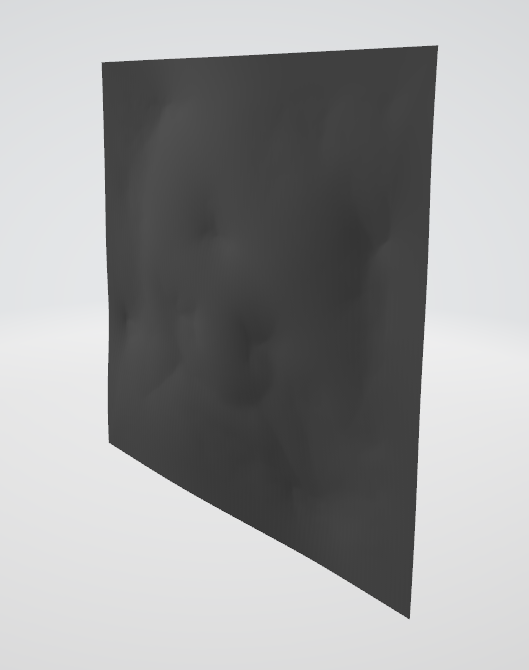
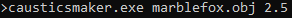
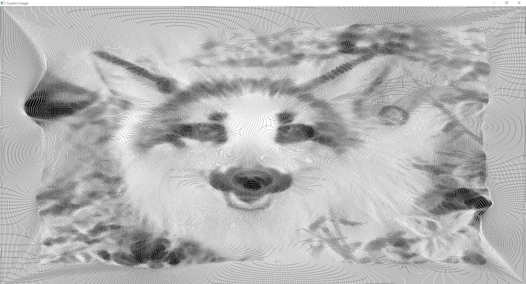

# caustics-display

A simple C++ program used to verify the caustics pattern produced by the output of [Kassubeck et al.'s implementation](https://github.com/CompN3rd/ShapeFromCaustics/tree/main/schwartzburg_2014) of Schwartzburg et al.'s [High-contrast computational caustic design](https://dl.acm.org/doi/10.1145/2601097.2601200).

## Dependencies

Make sure to include these when building the program.
- [SDL 2](https://www.libsdl.org/)
- [Eigen](https://eigen.tuxfamily.org/)

## How to use

1. First build the caustics display executable.
2. Run Kassubeck et al.'s implementation to obtain an .obj file for your target image. The target image must be 256x256 pixels.
3. Place the .obj file in the same directory as the built executable.
4. Open the command line in the same directory, and run:
`causticsdisplay.exe [filename].obj [receiver_plane]`
 The first argument is the .obj file, and the second argument is the distance to the receiver plane when generating the .obj file.
5. If successful, the display window will open shortly and the caustics pattern will be shown.
 The window can be resized to make the pattern more clear.
 Pressing W and S will increase or decrease the receiver plane distance, respectively, in order to fine-tune the spacing.
 Pressing Q will display the current distance in the console.

## Sample Screenshots

### Target image

 Photo of a marble fox I found on Google, made grayscale and shrunk down to 256x256

### Screenshot of the .obj file / lens shape generated by Kassubeck et al.'s code

  (file too large to upload to GitHub - I've uploaded it [here](https://mega.nz/file/2593DAST#vWJQIVjO7D_PTpi0Drja8bFXgGCo55YhR6MlpsjPxXI) to test with yourself!)

### Running the executable

### Caustics image

 (The display window was resized to be larger to make the image more clear, the program will start at 256x256 resolution. It may look a little funky in the README but you can still make out the image, full resolution in ./img/caustics.png!)
